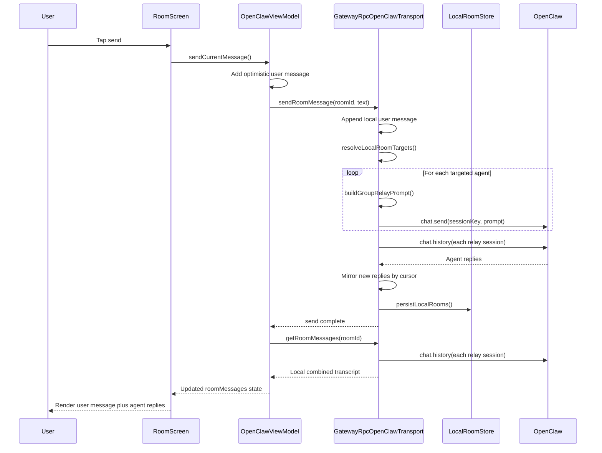

# Group Messaging Architecture

Last verified: 2026-04-22

This document explains how multi-agent group messaging works in the Android app today. The short version: group rooms are app-managed rooms stored locally on the device. OpenClaw does not currently provide one native shared group session for all agents, so the app creates a local room and relays each group turn into one room-specific OpenClaw session per targeted agent. Agent replies are then mirrored back into the single local room transcript.

## Source Map

| File | Responsibility |
| --- | --- |
| [OpenClawRepository.kt](../app/src/main/java/com/solovision/openclawagents/data/OpenClawRepository.kt) | Main group-message implementation: room creation, session key generation, target routing, relay prompts, OpenClaw `chat.send`, OpenClaw `chat.history`, reply mirroring, room deletion, and local-room persistence calls. |
| [LocalRoomStore.kt](../app/src/main/java/com/solovision/openclawagents/data/LocalRoomStore.kt) | Persists app-managed group rooms, room messages, reply cursors, relay session keys, and member display names in Android `SharedPreferences`. |
| [OpenClawViewModel.kt](../app/src/main/java/com/solovision/openclawagents/OpenClawViewModel.kt) | UI state owner for creating rooms, deleting rooms, sending messages, optimistic local message rendering, message refresh, polling, unread anchors, and read-state updates. |
| [AppModels.kt](../app/src/main/java/com/solovision/openclawagents/model/AppModels.kt) | Defines `Agent`, `CollaborationRoom`, `RoomMessage`, `MessageSenderType`, `AppUiState`, and notification-related state used by group messaging. |
| [HomeScreen.kt](../app/src/main/java/com/solovision/openclawagents/ui/screens/HomeScreen.kt) | Home UI for showing agents, creating group rooms, selecting room members, listing group rooms, and confirming group-room deletion. |
| [RoomScreen.kt](../app/src/main/java/com/solovision/openclawagents/ui/screens/RoomScreen.kt) | Chat UI for displaying the selected room, sending messages, polling while open, showing/hiding internal/tool/thinking messages, scrolling to unread/latest, and rendering bubbles. |
| [OpenClawAgentsApp.kt](../app/src/main/java/com/solovision/openclawagents/ui/OpenClawAgentsApp.kt) | Navigation glue that wires dashboard actions to `createRoom`, opens rooms, wires chat send to `sendCurrentMessage`, and starts/stops room polling. |
| [RoomReadStateStore.kt](../app/src/main/java/com/solovision/openclawagents/data/RoomReadStateStore.kt) | Stores the last read message key per room so the app can compute unread counts and jump near unread content when opening a chat. |
| [ConversationDisplayStore.kt](../app/src/main/java/com/solovision/openclawagents/data/ConversationDisplayStore.kt) | Stores whether internal messages are visible and the last opened room id. |
| [AgentVisibilityStore.kt](../app/src/main/java/com/solovision/openclawagents/data/AgentVisibilityStore.kt) | Stores hidden agents and manual agent ordering; hidden agents are excluded from new room member selection. |
| [NotificationPreferencesStore.kt](../app/src/main/java/com/solovision/openclawagents/data/NotificationPreferencesStore.kt) | Stores room notification preferences and last notified message keys. |
| [AppNotificationManager.kt](../app/src/main/java/com/solovision/openclawagents/data/AppNotificationManager.kt) | Displays Android notifications for newly detected room messages. |

## Core Concepts

| Term | Meaning |
| --- | --- |
| Local group room | A `CollaborationRoom` whose id starts with `local-room-`. It exists in this Android app's local storage. |
| Relay session | A real OpenClaw session created implicitly by sending to a session key like `agent:orion:room:tech-team-36354061`. Each group member gets one relay session per group room. |
| Member session map | A stored map of `agentId -> relaySessionKey` for a local group room. |
| Reply cursor | A stored map of `agentId -> lastAssistantMessageKey` used to know which assistant replies have already been mirrored into the group transcript. |
| Local transcript | The combined room messages shown in the Android UI. It includes the operator message once plus mirrored replies from each target agent. |
| Internal messages | System/tool/thinking messages that can be hidden in the UI but are still stored in the message list. |

## Lifecycle

### 1. Loading Agents And Rooms

`OpenClawViewModel` calls `refreshAgents()` and `refreshRooms()` during initialization. Agents come from `OpenClawRepository.getAgents()`, which uses `GatewayRpcOpenClawTransport.fetchAgents()`. Rooms come from `OpenClawRepository.getRooms()`, which uses `GatewayRpcOpenClawTransport.fetchRooms()`.

`fetchRooms()` requests OpenClaw `sessions.list` and converts direct OpenClaw sessions into `CollaborationRoom` objects. It also prepends `localRooms.values`, which are restored from `LocalRoomStore` in the transport initializer. This is why group rooms can show up beside normal direct-agent sessions even though group rooms are not native OpenClaw room objects.

### 2. Creating A Group Room

The create flow starts in [HomeScreen.kt](../app/src/main/java/com/solovision/openclawagents/ui/screens/HomeScreen.kt). The floating action button opens `CreateRoomDialog`, where the user enters a room name, optional purpose, and selected visible agents.

`OpenClawAgentsApp` wires the dialog confirm action to `viewModel.createRoom { roomId -> openChat(roomId) }`. `OpenClawViewModel.createRoom()` validates that the title is not blank and at least one agent is selected, then calls `repository.createRoom(title, purpose, selectedAgentIds)`.

The real work happens in `GatewayRpcOpenClawTransport.createRoom()`:

```text
room id: local-room-<timestampMs>
relay session key: agent:<agentId>:room:<room-title-slug>-<room-id-suffix>
```

For every selected member, the repository creates a deterministic relay session key with `groupRelaySessionKey(agentId, roomId, roomTitle)`. It stores these keys in `localRoomSessionKeys[room.id]`, stores display names in `localRoomMemberNames[room.id]`, creates an initial internal system message, snapshots the latest assistant message key for each relay session with `latestAssistantMessageKey(sessionKey)`, and persists everything with `persistLocalRooms()`.

The cursor snapshot is important. If an OpenClaw relay session already exists from a previous attempt or reused key, the app will not import old assistant replies into the new local transcript.

### 3. Showing Group Rooms On Home

`HomeScreenContent` builds `visibleRooms` from `uiState.rooms`, but filters out direct agent rooms (`agent:*` rooms with one member). The "Group Rooms" section therefore focuses on app-managed local rooms and any future non-direct room objects.

Only rooms with ids beginning `local-room-` show the delete affordance in the current home UI. That prevents the group-room delete flow from being confused with regular direct sessions.

### 4. Opening A Group Room

When the user opens a group room, `OpenClawAgentsApp.openChat(roomId)` calls `viewModel.selectRoom(roomId)` and navigates to the chat screen.

`selectRoom()` writes the selected room id through `ConversationDisplayStore`, clears the current unread anchor, and calls `refreshMessages(roomId)`. `refreshMessages()` calls `repository.getRoomMessages(roomId)`. For local group rooms, `GatewayRpcOpenClawTransport.fetchRoomMessages()` first calls `syncLocalRoomReplies(roomId, awaitReplies = false)`, then returns the locally stored transcript.

`RoomScreen` starts a polling loop with `DisposableEffect(roomId)`. The ViewModel polls every 2.5 seconds while the room is open. For group rooms, every poll asks the repository to fetch room messages, which again syncs relay-session replies before returning the local transcript.

### 5. Sending A Message

The send button in [RoomScreen.kt](../app/src/main/java/com/solovision/openclawagents/ui/screens/RoomScreen.kt) calls `OpenClawViewModel.sendCurrentMessage()`.

The ViewModel immediately adds an optimistic local `RoomMessage` so the UI feels responsive, clears the draft, and calls `repository.sendMessage(roomId, text)`. If sending fails, the optimistic message is removed and the draft text is restored.

For local group rooms, `GatewayRpcOpenClawTransport.sendRoomMessage()` does these steps:

1. Appends the operator's message to the persisted local room transcript with sender `SoLo`.
2. Resolves which agents should receive the turn with `resolveLocalRoomTargets(room, roomMessages, text)`.
3. For each target agent, looks up the relay session key from `localRoomSessionKeys`.
4. Builds an individualized group prompt with `buildGroupRelayPrompt(...)`.
5. Sends the prompt to OpenClaw with `chat.send`, using `deliver = true`, `thinking = medium`, and a unique idempotency key.
6. Adds an internal system delivery message if one or more target agents failed.
7. Calls `syncLocalRoomReplies(roomId, awaitReplies = true)` so fast replies can appear immediately.
8. Persists the local room snapshot.

For non-local rooms, `sendRoomMessage()` sends directly to the selected OpenClaw session key with `chat.send`.

### 6. Targeting Rules

Targeting is implemented in `resolveLocalRoomTargets()` in [OpenClawRepository.kt](../app/src/main/java/com/solovision/openclawagents/data/OpenClawRepository.kt).

The rules are:

| User message shape | Target behavior |
| --- | --- |
| Room has one member | Send to that one member. |
| Message contains `@all`, `everyone`, `everybody`, `all of you`, `whole team`, or `entire team` | Send to every room member. |
| Message contains an explicit agent alias such as `@halo`, `halo`, `@orion`, or the display-name parts generated by `buildAgentAliases()` | Send to matching agents only. |
| No broadcast phrase and no explicit target, but a previous agent reply exists in the local transcript | Continue with the most recent replying agent. |
| No broadcast phrase, no explicit target, and no previous agent reply | Send to all room members. |

The last rule is intentional: a fresh group room defaults to everyone unless the user targets a specific agent. After an agent has replied, a follow-up without a mention is treated like a continuation with that most recent agent.

### 7. Prompt Shape Sent To Agents

Each targeted agent receives a prompt built by `buildGroupRelayPrompt()`. The prompt tells the agent:

```text
You are participating in the OpenClaw group room "<room title>".
You are <current agent name>.
Participants: <all member display names>
This turn is addressed to: <target display names>
Shared room purpose: <room purpose>

Recent room transcript:
<last 12 non-system messages>

Latest user message:
<operator message>

Reply as <current agent name>. Consider the recent room transcript so your response stays aware of what the rest of the team already said.
```

This is how agents get context about what other agents said. They do not share one backend memory stream. The Android app synthesizes shared context by injecting the recent local room transcript into each targeted agent's relay session.

### 8. Mirroring Replies Back Into The Group

Reply syncing is implemented by `syncLocalRoomReplies()` and `syncLocalRoomRepliesOnce()`.

When a group room is fetched or after a group message is sent, the repository checks each member's relay session:

1. Fetch OpenClaw `chat.history` for that member's relay session key.
2. Keep only messages whose sender type is `AGENT`.
3. Compare those agent messages against the stored cursor for that member.
4. Mirror only new assistant messages into the local room transcript.
5. Rewrite the mirrored message id and message key as `local-room-<roomId>-<remoteMessageKey>` so the local transcript has stable unique ids.
6. Preserve the message body and internal flag, replace the sender name with the room member display name, and default blank sender roles to `Agent`.
7. Update the cursor to the latest assistant message key.
8. Persist the local snapshot if any reply was added.

After a send, `awaitReplies = true` polls up to six times with a one-second delay. When just opening or polling the room, `awaitReplies = false` checks once and returns quickly.

### 9. Persistence

Group rooms survive app restarts because `LocalRoomStore` writes one JSON snapshot into Android `SharedPreferences`.

The snapshot contains:

| Snapshot field | Contents |
| --- | --- |
| `rooms` | The local `CollaborationRoom` records. |
| `messages` | The local transcript for each room id. |
| `replyCursors` | Per-room, per-agent last mirrored assistant message keys. |
| `sessionKeys` | Per-room, per-agent relay session keys. |
| `memberNames` | Per-room, per-agent display names captured at creation time. |

If the snapshot is blank or cannot be parsed, `LocalRoomStore.read()` returns an empty snapshot. That avoids crashes from corrupted local room JSON, but it also means local app-managed groups can disappear if the stored JSON becomes unreadable.

### 10. Deleting A Group Room

Deletion starts in [HomeScreen.kt](../app/src/main/java/com/solovision/openclawagents/ui/screens/HomeScreen.kt). `DeleteRoomDialog` confirms that the app will delete the local group room and every room-specific relay session.

`OpenClawViewModel.deleteRoom(roomId)` calls `repository.deleteRoom(roomId)`, clears read state for that room, reloads rooms, removes cached messages for that room, and selects a fallback visible room.

For local group rooms, `GatewayRpcOpenClawTransport.deleteRoom()`:

1. Gets all relay session keys from `localRoomSessionKeys[roomId]`.
2. Calls `deleteGatewaySession(sessionKey)` for every relay session.
3. If any relay session deletion fails, throws an error and keeps the local room so the user can retry.
4. If all relay sessions delete successfully, removes the room, messages, reply cursors, session keys, and member names from local memory.
5. Persists the updated local room snapshot.

The conservative behavior is intentional. If the app removed the local room after only some relay sessions were deleted, it could leave orphaned room-specific sessions in OpenClaw with no easy way for the UI to clean them up.

### 11. Read State, Unread Jump, And Notifications

`RoomReadStateStore` stores the last read message key for each room. When `refreshMessages()` loads messages for the selected room, the ViewModel computes an unread anchor from the previously read message key, marks the room as read, and stores the anchor in `selectedRoomUnreadAnchorKey`.

`RoomScreen` uses that anchor during the initial scroll. If an unread anchor exists and is visible under the current internal-message filter, it scrolls to that message. Otherwise it scrolls to the latest visible message.

Notification polling is handled in `OpenClawViewModel.pollRoomsForNotifications()`. It calls `repository.getRooms()` and `repository.getRoomMessages(room.id)` for each room. For group rooms, that means background notification polling also syncs relay-session replies into the local room transcript. `NotificationPreferencesStore` tracks room notification settings and the last notified message key, and `AppNotificationManager` renders the Android notification.

### 12. Internal Message Visibility

`RoomScreen` computes `visibleMessages` from all room messages. When `showInternalMessages` is off, it filters out messages where `internal == true` or `senderType == SYSTEM`.

This is display-only filtering. The messages remain in `LocalRoomStore`, remain available for debugging, and may still be part of source data used elsewhere. The group relay prompt itself filters out system messages in `buildRecentGroupTranscript()`, so internal system routing/delivery messages are not injected into agent context.

## Sequence Diagram



## Known Limitations

| Limitation | Impact |
| --- | --- |
| Groups are local app constructs, not native OpenClaw shared rooms. | Another device will not automatically see the same local group list unless it has the same local snapshot. |
| Agents have separate relay sessions. | They do not share true server-side group memory; the app provides recent context in the prompt. |
| Reply syncing is polling-based. | Slow replies may appear on the next room poll or notification poll instead of instantly. |
| Mention detection is heuristic. | Short or overlapping aliases can target more agents than intended. Use `@agent-name` or `@all` for clarity. |
| Only the last 12 non-system messages are injected as group context. | Very long group conversations may lose older context unless the agent's relay session retained enough useful memory. |
| Local snapshot corruption falls back to empty state. | This prevents crashes but can make local groups disappear. |
| Deletion requires every relay session delete to succeed. | A server/auth/session-delete failure keeps the local room visible so cleanup can be retried. |
| Internal/tool/thinking filtering is display-only. | Hidden details are still stored locally and can be shown again. |

## Debugging Checklist

Use this checklist when group sending or reply mirroring seems broken:

| Symptom | Check |
| --- | --- |
| Group room does not appear after creation | Verify `OpenClawViewModel.createRoom()` succeeded, then check `LocalRoomStore` persistence and `GatewayRpcOpenClawTransport.fetchRooms()` returning `localRooms.values`. |
| Message shows locally but no agents respond | Check `resolveLocalRoomTargets()` output in logcat: `Routing local room message roomId=... targets=...`. |
| Only some agents respond | Check failed delivery system messages and logcat entries: `Failed relaying local room message to <agentId>`. |
| Agent replies exist in OpenClaw but not in app | Check `syncLocalRoomReplies` logs for history count, assistant count, previous cursor, and new assistant count. |
| Old relay-session messages appear unexpectedly | Check whether `latestAssistantMessageKey()` failed during room creation, leaving the initial cursor null. |
| Duplicate replies appear | Check mirrored ids generated as `local-room-<roomId>-<messageKey>` and whether remote message keys are stable. |
| Room delete fails | Check which relay session keys are listed in the error and retry after confirming OpenClaw delete permissions/session state. |
| App jumps to the wrong spot on open | Check `RoomReadStateStore`, `unreadAnchorKey()`, and whether internal messages are currently hidden. |

## Design Intent

This architecture keeps the mobile UI simple while making group chat possible against an OpenClaw backend that primarily exposes agent sessions. The Android app owns the group abstraction, OpenClaw owns the actual agent execution sessions, and the relay layer bridges them. It is intentionally reversible: if OpenClaw later adds true server-backed group rooms, the app can replace the local relay implementation behind the same `OpenClawRepository` interface while preserving most UI behavior.
